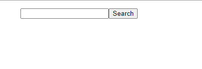

## Weather App

The weather app project goals are to use an API and AJAX call to allow the user to enter a city name and get the response of current weather and the 5 day forecast. This project also required the use of JQuery.

##Challenges

The challenges keep escalating. I have many hours into this project and feel I do not have much to show for it. I am hopeful within a few weeks I will aquire the skills to come back and complete this project to the full expectation.

##Project Links

https://github.com/chadclark1234/Weather-App

https://chadclark1234.github.io/Weather-App/

